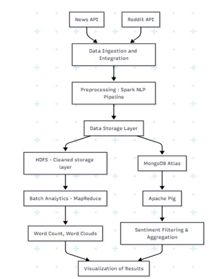

# 📊 Voices and Views: Tracking Public Pulse on Indian Government Schemes

A comprehensive Big Data pipeline that extracts, analyzes, and visualizes public sentiment about Indian government schemes using news articles and Reddit comments. Built using Apache Spark, Spark NLP, MongoDB, MapReduce, and Apache Pig, the system transforms unstructured text into policy-relevant insights.



---

## 🚀 Project Objectives

- Ingest news and social media data about government schemes
- Clean and process noisy, multilingual text data
- Perform sentiment analysis using deep learning models
- Store and manage processed data for real-time and batch analytics
- Visualize scheme-wise public opinion using dashboards and word clouds

---

## 🛠️ Tech Stack

| Layer           | Tools / Libraries |
|----------------|-------------------|
| Language        | Python 3.10, PySpark |
| Big Data        | Apache Spark 3.4, Hadoop 3.3, Apache Pig |
| NLP             | Spark NLP 5.1.4, Universal Sentence Encoder |
| Storage         | MongoDB Atlas, HDFS |
| Visualization   | Matplotlib, Seaborn, WordCloud |
| Social Data     | NewsAPI, Reddit (AsyncPRAW) |

---

## 🧠 NLP and Sentiment Pipeline

1. **Preprocessing**: Tokenization, Normalization, Lemmatization, Stopword Removal  
2. **Embedding**: Universal Sentence Encoder  
3. **Sentiment Classification**: `sentimentdl_use_twitter` model via Spark NLP  
4. **Storage**: MongoDB for cleaned data; HDFS for batch jobs  
5. **Visualization**: Word clouds, sentiment bar charts, and timelines

---

## 📦 Folder Structure

```bash
.
├── data/
│   ├── sentiment_data.csv        # Merged News + Reddit with sentiments
│   ├── pig_sentiment_counts.csv  # Pig output for sentiment count
│   └── pig_avg_scores.csv        # Pig output for avg scores
├── scripts/
│   ├── extract_news.py
│   ├── fetch_reddit.py
│   ├── clean_nlp_pipeline.py
│   └── sentiment_analysis.pig
├── visualizations/
│   ├── sentiment_distribution.png
│   ├── scheme_wordclouds/
├── assets/
│   └── system_architecture.png
└── README.md
